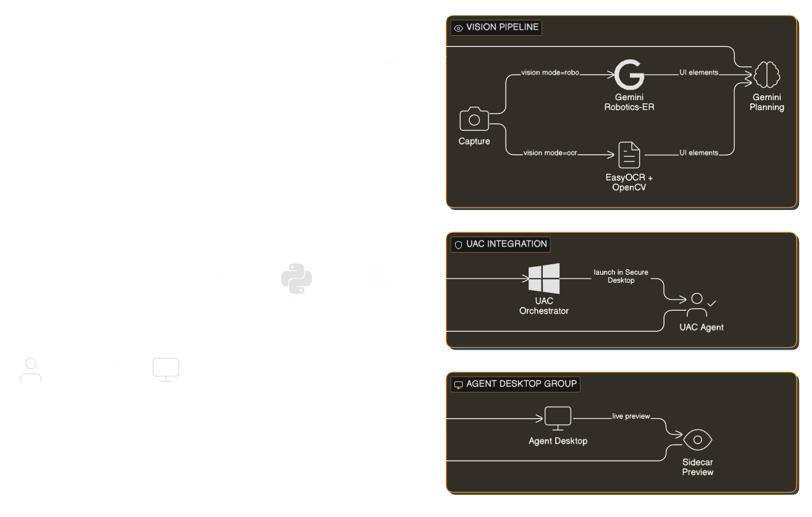

# PixelPilot


**Pilot Your Pixels.**

PixelPilot is a high-performance Windows desktop automation agent powered by **Gemini (Google GenAI SDK)** and advanced computer vision. It transforms natural language commands into precise mouse and keyboard actions, orchestrating a hybrid pipeline of vision-based and blind control across multiple isolated desktop workspaces.

## Architecture



> [View Detailed Architecture Diagram](src/logos/System-Architecture_Detailed.png)

## Key Features

### 🚀 Hybrid Planning & Execution
- **Turbo Mode (Enabled by Default)**: Optimizes planning by batching multiple stable actions into a single execution sequence.
- **Blind Mode**: The agent can plan and act without screenshots (using OS skills and hotkeys) when visual context is not required.
- **Interactive-First Planning**: Every task starts with a "Blind Step 1" to intelligently decide on the workspace (User vs Agent) before triggering vision.
- **Task Verification & Deferred Replies**: Performs optional screen analysis to confirm success. Replies are buffered and only displayed after verification is complete.

### 👁️ Advanced Vision System
- **Lazy Vision Pipeline**: Implements a tiered approach—tries lightweight local OCR (EasyOCR + OpenCV) (default) first and **Gemini Robotics-ER** for complex semantic understanding or unknown icons. 
- **Incremental Screenshots**: Only captures and analyzes new screenshots when the screen state has changed, significantly reducing API latency.

### 🖥️ Desktop Orchestration
- **Agent Desktop (Isolated Workspaces)**: Seamlessly switch between the live `user` desktop and an isolated `agent` desktop.
- **Situational Logic**: Automatically favors the Agent Desktop for generic web tasks (browsing, research, Gmail, CLI) while reserving the User Desktop for local file interaction.
- **Sidecar Preview**: A high-performance, live preview of the Agent Desktop.

### 🛡️ System Integration & Security
- **UAC / Secure Desktop Support**: A dedicated SYSTEM service (UAC Orchestrator) allows the agent to see and interact with Secure Desktop prompts.
- **Loop Detection & Reflexion**: Detects repeated actions using perceptual hashing and uses "reflexion" logic to suggest alternatives or ask for clarification.
- **Task Verification**: Performs optional post-task screen analysis to confirm the user's goal was actually achieved.

### Skills and Tooling
- **Media / Browser / System / Timer skills**: Uses OS APIs where possible instead of UI driving.
- **Smart App Indexer**: Uses Start Menu shortcuts, running processes, and registry to find apps.
- **Voice input**: Mic button uses SpeechRecognition with an audio level visualizer.
- **Global hotkeys**: System-wide hotkeys work even when the overlay is click-through.

## Operation Modes
- **GUIDANCE**: Interactive, step-by-step tutorial mode. You do the actions while PixelPilot watches and helps.
- **SAFE**: Confirms only potentially dangerous actions (like delete, shutdown).
- **AUTO**: Runs fully autonomously without requiring confirmation.
- **Blind mode**: When vision is not needed, PixelPilot can plan and act without screenshots and switch back to vision when required.

## Quick Start

### 1. Installation

Run the installer to set up the Python environment and (optionally) the UAC orchestrator and launcher tasks.

```bash
python install.py
```

What it does:
- Creates a `venv` and installs `requirements.txt`.
- Compiles the UAC helper executables from [src/uac/orchestrator.py](src/uac/orchestrator.py) and [src/uac/agent.py](src/uac/agent.py).
- Creates scheduled tasks:
    - `PixelPilotUACOrchestrator` (runs as SYSTEM on startup)
    - `PixelPilotApp` (launcher task; the Desktop shortcut runs this task)
- Creates a Desktop shortcut that runs `schtasks /RUN /TN "PixelPilotApp"`.

Optional (deps only, no scheduled tasks or shortcut):

```bash
python install.py --no-tasks
```

### 2. Configuration

Create a `.env` file in the repository root (next to [install.py](install.py)):

```env
GEMINI_API_KEY=your_api_key_here
GEMINI_MODEL=gemini-3-flash-preview

# Default UI mode: guide | safe | auto
DEFAULT_MODE=auto

# Runtime override (if set, overrides DEFAULT_MODE)
AGENT_MODE=auto

# Vision mode: robo | ocr
VISION_MODE=robo

# Optional: WebSocket gateway auth token
PIXELPILOT_GATEWAY_TOKEN=pixelpilot-secret
```

Tip: you can start from [env.example](env.example).

Notes:
- `GEMINI_API_KEY`: If set, PixelPilot connects directly to Gemini (bypassing the backend proxy). No login required.
- `DEFAULT_MODE`: Selects the initial UI mode.
- `AGENT_MODE`: Overrides `DEFAULT_MODE` when present.
- `VISION_MODE`: `robo` (Gemini Robotics-ER) or `ocr` (local OCR + CV).

### 3. Run

**Method 1: Desktop Shortcut (Recommended)**
Double-click the PixelPilot shortcut. This launches the agent with the permissions needed to communicate with the UAC orchestrator.

**Method 2: Command Line**

```bash
.\venv\Scripts\python.exe .\src\main.py
```

Notes:
- PixelPilot is GUI-first (PySide6). You can change Mode and Vision from the dropdowns.
- On Windows, PixelPilot tries to relaunch with Administrator privileges. If you decline, some automation is limited.
- Logs are written to `logs/pixelpilot.log` (and launcher logs to `logs/app_launch.log`).

### Hotkeys (system-wide)
- `Ctrl+Shift+Z` - Toggle click-through (overlay interactive vs click-through)
- `Ctrl+Shift+X` - Stop current request
- `Ctrl+Shift+Q` - Quit PixelPilot

## Architecture

PixelPilot uses a modular, multi-process architecture to bridge userland automation and Secure Desktop.

1. **Modular Agent Core (`src/agent/`)**
     - **Core Orchestrator ([core.py](src/agent/core.py))**: Manages the main task loop, workspace switching, and state synchronization.
     - **Action Executor ([actions.py](src/agent/actions.py))**: Decoupled execution logic for browser skills, app launching, and UI interaction.
     - **Screen Capture ([capture.py](src/agent/capture.py))**: High-performance screenshot pipeline with perceptual hashing for change detection.
     - **Prompts ([prompts.py](src/agent/prompts.py))**: Centralized prompt engineering for all agent modes.

2. **Main Application ([src/main.py](src/main.py))**
     - Provides the PySide6 UI and routes agent output into the GUI.
     - Handles secure session management and API key clearing on logout.

3. **UAC Orchestrator ([src/uac/orchestrator.py](src/uac/orchestrator.py))**
     - Runs as SYSTEM via Task Scheduler on boot.
     - Watches for triggers and launches the UAC Agent in the WinLogon Secure Desktop session.

4. **UAC Agent ([src/uac/agent.py](src/uac/agent.py))**
     - Captures Secure Desktop snapshots and interacts with elevated prompts.

5. **Agent Desktop**
     - Isolated desktop sandbox via [src/desktop/desktop_manager.py](src/desktop/desktop_manager.py).
     - Minimal taskbar shell for the agent session plus a sidecar preview in the main UI.

## Optional WebSocket Gateway

There is a simple gateway server in [src/services/gateway.py](src/services/gateway.py) that accepts JSON commands over WebSocket and runs them through the agent. It is not started by default; import and run it from your own entry point if needed.

## Usage Examples

Natural language commands:
- "Open Calculator and calculate 25 * 34"
- "Find Spotify and play the next song"
- "Open Device Manager as admin" (triggers UAC orchestrator)
- "Search Google for Python tutorials and open the first link"

PixelPilot runs as a standard desktop GUI app; close the window to exit.

## Uninstall

Run the uninstaller (removes scheduled tasks, shortcut, venv, dist, logs, media, and cache):

```bash
python uninstall.py
```

Optional flags:
- `--no-tasks` to keep scheduled tasks and the desktop shortcut.
- `--keep-venv` to keep the venv directory.
- `--keep-dist` to keep the dist directory.
- `--keep-logs` to keep logs.
- `--keep-media` to keep media outputs.
- `--keep-cache` to keep the app index cache.

## Troubleshooting

- If the app opens and closes immediately, verify `.env` has `GEMINI_API_KEY`.
- Check logs in `logs/pixelpilot.log`.
- If UAC handling does not work:
    - Re-run `python install.py` as Administrator to recreate scheduled tasks.
    - Verify the `PixelPilotUACOrchestrator` scheduled task is running.

---

**Made with Gemini + Advanced Computer Vision.**
